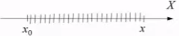
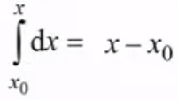
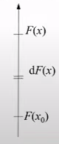
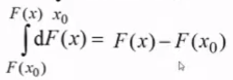
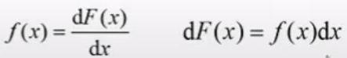
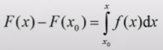

# Лекция 2 - Название

## Расчет потенциала по известной зависимости напряженности поля от координаты

Если мы знаем зависимость `потенциала от напряженности`, то мы пользуемся `дифференциальной связью`. Если знаем
зависимость от `напряженности для потенциала`, то мы пользуемся `интегральной связью`, которая позволяет посчитать
разность потенциалов между двумя точками.

*Расчет потенциала*

Если мы хотим узнать потенциал в одной точке, потенциал в другой должен быть известен.

`Интегрирование` - это суммирование бесконечно малых частиц.
Пусть есть отрезок `X` с началом `X~0~`. Он поделен на
отрезки длинной `ΔX`, каждый отреок назову `dx~i~`

Просуммируем все `ΔX`:

 - сумма измененений x координаты.

Усложняем задачу:

`ΔX` = `dx`, но буква d (дельта, указывает на то, что это бесконечно малые отреки).

Просуммируем эти отрезки, в математике для такого суммирования используется `∫`- знак интеграла, в качестве пределов указыается `X` и `X~0~` (начало и конец оси)

Еще усложним,построим вертикальную ось, обозначим `F(x)` - конец функции, `F(x~0~)` - начало функции. Разделим отрезок на маленькие части (dx). Каждая малая часть - есть приращение функции. 

Просуммиуем:

 

**Если у функции F есть производная, то из этой формулы приращение функции можно выразить:**

*Производная - предел отношения приращения функции к приращению аргумента.*

Основная формула, по которой расчитываются все интегралы: 

[калькулятор интегралов](https://www.integral-calculator.ru/){ target='_blank' }
