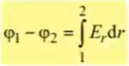
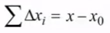
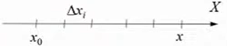

# Лекция 2 - Название

## Расчет потенциала по известной зависимости напряженности поля от координаты

Если мы знаем зависимость `потенциала от напряженности`, то мы пользуемся `дифференциальной связью`. Если знаем
зависимость от `напряженности для потенциала`, то мы пользуемся `интегральной связью`, которая позволяет посчитать
разность потенциалов между двумя точками.

*Расчет потенциала*

Если мы хотим узнать потенциал в одной точке, потенциал в другой должен быть известен.

`Интегрирование` - это суммирование бесконечно малых частиц. Пусть есть отрезок `X` с началом `X~0~`. Он поделен на
отрезки длинной `ΔX`

Просуммируем все `ΔX`:

[калькулятор интегралов](https://www.integral-calculator.ru/){ target='_blank' }

