# Доверительные интервалы в случае нормальных выборок.

Пусть случайная величина X имеет неизвестную характеристику `~0~`.

Это может быть, например, `числовая характеристика случайной величины`, параметр и т. д. 
Идея, лежащая в основе интервального оценивания характеристики `~0~` состоит в том,
что по результатам наблюдений Х1, Х2, Хn определяют две величины `~0~` = `~0~`.(Х1,Х2,..,Хn) и `~Ō~` = `~Ō~`(Х1,Х2,..,Хn) такие, что

где γ — наперед заданная вероятность. 
Величины `~0~` и `~Ō~` называют доверительными границами, а интервал (`~0~`,`~Ō~`) — доверительным интервалом для `~0~`, соответствующим уровню надежности γ.

Строить доверительный интервал можно исходя из точечной оценки. Пусть для `~0~` известна точечная оценка ~Ō~. Подберем εγ такое, чтобы выполнялось равенство

                   (13.1)

где γ — выбранная заранее вероятность. Тогда

и (`~Ō~` - εγ,`~Ō~` + εγ) можно рассматривать как доверительный интервал для `~0~`.Так что задача состоит в том, чтобы по заданному γ выбрать соответствующее еγ. 

На основании *(13.1)* можно гарантировать, что с вероятностью γ значение точечной оценки отличается от неизвестного значения `~0~`  меньше, чем на еγ.

Вероятность γ обычно выбирают настолько близкой к единице, чтобы ее можно было считать вероятностью практически *достоверного события*. 

Тогда соответствующий доверительный интервал можно считать *интервалом практически возможных значений `~0~`, или интервалом значений `~0~`, не противоречащих опытным данным.*

# § 13.1. ДОВЕРИТЕЛЬНЫЙ ИНТЕРВАЛ ДЛЯ         МАТЕМАТИЧЕСКОГО ОЖИДАНИЯ

а) *Случай большой выборки*

Пусть закон распределения случайной величины X неизвестен.

Неизвестны также М(Х) и D(X), причем D(Х) < ∞. Над случайной величиной проделано n независимых наблюдений и получена выборка значений Х1,Х2,...,Хn.

Если число наблюдений достаточно велико (хотя бы несколько десятков), то

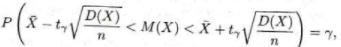               (13.2)
                    
где X — среднее арифметическое результатов наблюдений, а tγ выбирается из таблицы функции Лапласа так, чтобы
2Ф0(tγ) = γ.
Возможен случай, когда дисперсия случайной величины известна, а неизвестно лишь математическое ожидание этой величины. 

Такая ситуация возникает при измерении постоянной величины о прибором, который не имеет систематической ошибки. 

Если дисперсия случайной ошибки прибора предварительно изучена и известна, то (13.2) можно рассматривать как доверительный интервал для истинного значения измеряемой величины. В самом деле, в результате измерения получается значение случайной величины X = a + У, где У — случайная ошибка. 

По предположению D(У) — известна, а М(У) = 0 в виду отсутствия систематической ошибки. Тогда

                                                 М(Х) =  M(a + Y) = a
   и 
                                         D(Х) = D(а + Y) = D(а) + D(Y) = D(Y).
                                         
Остается подставить найденные величины в (13.2).

Если вместе с M(X) неизвестна и D(Х), то из тех же опытных данных можно получить несмещенную и состоятельную оценку для дисперсии по формуле:

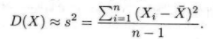                   (13.3)

Тогда (13.2) имеет вид

                  	(13.4)
      
В выводе формулы (13.4) ключевую роль играет тот факт, что при большом числе независимых наблюдений среднее арифметическое их результатов имеет близкий к нормальному закон распределения. 

Формулу (13.4) можно использовать для любой случайной величины, лишь бы число наблюдений было достаточно велико (хотя бы несколько десятков).

б) *Случай малой выборки*

При небольшом числе наблюдений для построения доверительного интервала необходима информация о типе закона распределения случайной величины. Рассмотрим практически важный случай, когда X ~ N(m;σ2).

Если σ2 известно, а неизвестно лишь m, то при независимых наблюдениях можно воспользоваться свойством устойчивости нормального закона распределения.

Согласно этому свойству сумма независимых случайных величин, подчиненных нормальному закону распределения, сама имеет нормальный закон распределения.
Поэтому в названных условиях и при небольшом числе наблюдений можно утверждать, что X имеет близкий к нормальному закон распределения и использовать формулу (13.2).

Если дисперсия σ2 неизвестна, то при небольшом числе наблюдений ее оценка на основе опытных данных получается грубой и формула (13.4) не решает задачи построения доверительного интервала.
Английский статистик Стьюдент (У. Госсет) для X ~ N(m;σ2) с неизвестными параметрами m и σ2 в предположении независимости опытов изучил величину

                                 
где s2 — оценка дисперсии по формуле (13.3), а n — число наблюдений. 

Оказалось, что распределение величины Т не зависит ни от X, ни от s, а зависит лишь от числа n — 1, которое принято называть числом степеней свободы. Стьюдент нашел функцию плотности вероятности fn-1(t) и с ее помощью вычислил вероятности

               	(13.5)
                      
которые свел в таблицу (см. приложение, табл. 3).

При заданном уровне надежности γ по таблице распределения Стьюдента для n — 1 степени свободы можно найти соответствующее tУ.
Подстановка этого tУ в (13.5) приводит к

                                     
или 
  
        (13.6)

Формула (13.6) по структуре похожа на формулу (13.4), но tУ  в этих формулах определяется по разным таблицам.

**ПРИМЕР 13.1.**

Измерения сопротивления резистора дали следующие результаты (в омах): Х1 = 592, Х2 = 595, Х3 = 594. Х4 = 592, Х5 = 593, Х6 = 597, Х7 = 595. Х8 = = 589, Х9 = 590. Известно, что ошибки измерения имеют нормальный закон распределения. Систематическая ошибка отсутствует. Построить доверительный интервал для истинного сопротивления резистора с надежностью 0,99 в предположении:
а) дисперсия ошибки измерения известна и равна 4; 
6) дисперсия ошибки измерения неизвестна.
 - В данной серии из девяти наблюдений

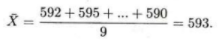

Если дисперсия ошибки измерения известна, то можно воспользоваться формулой (13.2). Для этого из таблицы функции
Лапласа (см. приложение, табл. 2) находим, что 2Ф0(2,58) = 0,99. т. е. уровню надежности 0,99 соответствует значение tУ = 2,58. Тогда по формуле (13.2)

593 - 2,58 * 2/√9  < М(Х) < 593 + 2,58 * 2/√9

или
                               
591,28 < М(Х) < 594,72 с вероятностью 0,99.

В случае неизвестной дисперсии ее можно оценить на основе тех же опытных данных:
                      
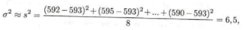                     
                    
s  = √6,5 ≈ 2,55/
                      
По таблице распределения Стьюдента (см. приложение, табл. 3) для n - 1 = 9 - 1 = 8 степеней свободы и заданной вероятности γ = 0,99 находим  tУ = 3,355. Тогда по формуле (13.6)

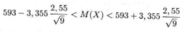
                                    
или 590,15 < М (X) < 595,85 с вероятностью 0.99. 

**ПРИМЕР 13.2.** 

В таблице приведены сгруппированные данные измерений роста у 50 наугад выбранных студентов:

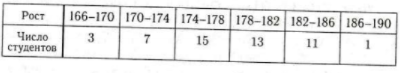

Оценить средний рост и дисперсию роста студентов. Построить доверительный интервал для среднего роста студентов с надежностью 0,9.

- Так как данные сгруппированы, то в качестве представителя каждого интервала можно взять середину этого интервала. Тогда
                     
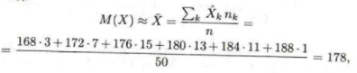
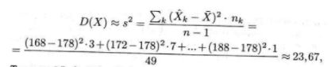
                    
Так как 2Ф0(1,65) = 0,9, то по формуле (13.4) имеем

                 
или 176,86 < М(Х) < 179,14 с вероятностью 0,9. 

**ПРИМЕР 13.3**

По результатам девяти измерений емкости конденсатора получена оценка X = 20 мкФ Среднеквадратическая ошибка измерения известна и равна 0,04 мкФ. Построить доверительный интервал для емкости конденсатора с надежностью 0,95.

- В предположении, что ошибки измерения имеют нормальный закон распределения можно воспользоваться формулой (13.2). 
Так как 2Ф0(1,96) = 0,95. то

20 - 1,96 * 0,04 / 3 < M (X) < 20 + 1 > 1,96 * 0,04 / 3   

или 

19,974 < М(Х) < 20,026 с вероятностью 0,95.

# § 13.2. ДОВЕРИТЕЛЬНЫЙ ИНТЕРВАЛ ДЛЯ

ВЕРОЯТНОСТИ СОБЫТИЯ

Пусть вероятность Р(А) = р неизвестна. 
Проделаем n независимых опытов и определим k/n — частоту события в данной серии опытов. 
Если n достаточно велико, то вероятность и частота события связаны соотношением:
 
            (13.7)
 
К сожалению, в формуле (13.7) доверительные границы для вероятности р выражаются через саму эту неизвестную вероятность. Это затруднение можно обойти заметив, что pq <= 1/4. Тогда (13.7) можно записать в виде
   
 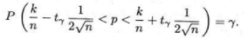             (13.8)

Оценка pq величиной 1/4 приемлема, если есть уверенность, что неизвестная вероятность p близка к 1/2.
Но при значениях р близких к нулю или единице такая оценка слишком груба.
Например, при р = 0,1 получаем всего лишь pq = 0,1* 0,9 = 0,09 вместо 0,25.
Можно точный доверительный интервал заменить приближенным, если учесть, что при большом числе опытов k/n ≈ p в силу закона больших чисел:

                (13.9)
 
**ПРИМЕР 13.4**

Для обследования большой партии изделий (несколько тысяч штук) наугад выбрано 160 изделий. 
Среди них оказалось 56 изделий низкого сорта. Оценить долю изделий низкого сорта в этой партии с надежностью 0,95.

- Так как партия изделий крупная, то для упрощения можно считать, что по мере выбора изделий состав партии заметно не изменяется и вероятность выбрать наугад изделие низкого сорта равна доле низкосортных изделий в этой партии. 
Тогда задача сводится к построению доверительного интервала для вероятности выбора из этой партии изделия низкого сорта. Частота изделий низкого сорта в выборке k/n = 56/160 = 0,35.
Из таблицы функции Лапласа следует, что 2Ф0(1,96) = 0,95. Поэтому

 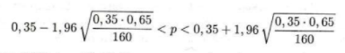 

или 0,27 < р < 0,42. 
Итак, по данной выборке можно с вероятностью 0,95 утверждать, что во всей партии содержится от `27%` до `42%` изделий низкого сорта.

**ПРИМЕР 13.5**

Было проведено 400 испытаний механизма катапультирования. В этих испытаниях не зарегистрировано ни одного отказа.
С надежностью 0,95 оценить вероятность отказа механизма катапультирования.

- В данной серии испытаний частота появления отказа к/400 = 0. Поэтому непосредственно использовать формулу (13.9) нельзя. Заметим, что p * q <= 1/4, так как р + q = 1. 
Функция Лапласа Ф0(х) строго возрастает. 

Поэтому меньшему значению аргумента соответствует меньшее значение функции. В расчете на худший вариант можно воспользоваться формулой (13.8). 
По таблице функции Лапласа находим, что 2Ф0(х)(1,65) = 0,95. 
Поэтому tγ = 1,65 и 0 < р < 1,65 * 1/2√400 = 0,041.

Доверительный интервал (0;0,041) построен в расчете на худший вариант, когда вероятность события близка к 1/2.
Но большое число опытов (n = 400) и нулевая частота события в них позволяют с уверенностью утверждать, что вероятность события близка к нулю.
Если несколько ухудшить статистику испытаний и посчитать что один отказ все-таки наблюдался, то p * q ≈ 1/40 * 399/400 = 0,0025. Тогда по формуле (13.9) получаем приближенный доверительный интервал

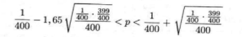 
              
или 0 < р < 0,0066. Это приближенный доверительный ин­тервал. но он определенно более точен, чем грубая оценка по формуле (13.8).

**ПРИМЕР 13.6**
Сколько независимых наблюдений нужно проделать, чтобы с вероятностью 0,95 можно было построить доверительный интервал для вероятности события шириной не более 0,2?
- По таблице функции Лапласа (см. приложение, табл. 2) находим, что 2Ф0(х)(1,96) = 0,95.
Вероятность события неизвестна. Так как pq <= 1/4, то и k/n (1 - k/n) <= 1/4. 
Доверительный интервал располагается симметрично относительно частоты события, поэтому в формуле (13.9)                                                                           
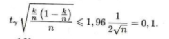 

Откуда √n = 1,96/0,2 = 9,8. Следовательно, т = 96,04. т. е.
т > 96. 

